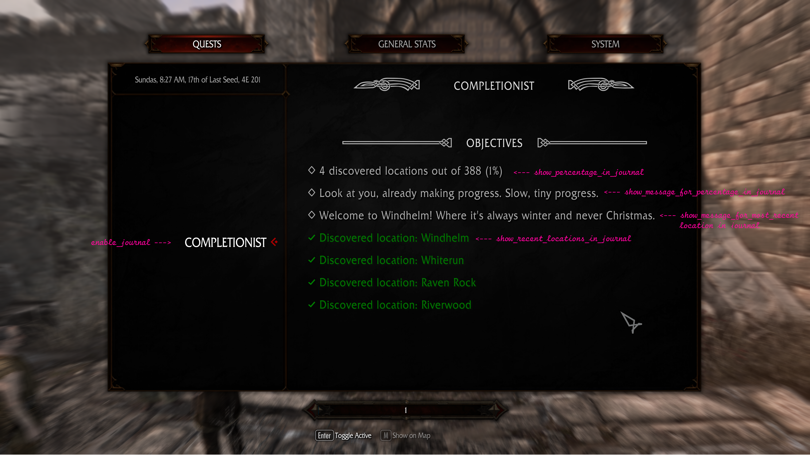
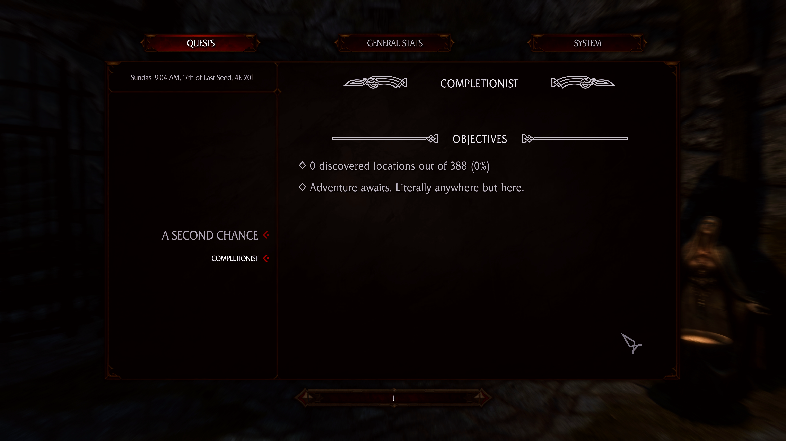

# One Hundred Percent 💯

> _previously known as: Haz the Completionizt_

**[Download from Releases](https://github.com/MrowrMisc/HazTheCompletionizt/releases)**

# Screenshots






# Configuration Files

```
\---SKSE
    \---Plugins
        |   HazTheCompletionizt.toml
        |   
        \---HazTheCompletionizt
                IgnoredLocationNames.json
                IgnoredMapMarkers.json
                OnMatchingLocationCleared.json
                OnMatchingLocationDiscovered.json
                OnSpecificLocationCleared.json
                OnSpecificLocationDiscovered.json
                PercentageDiscoveredMessages.json
```

## `HazTheCompletionizt.toml`

```toml
[OnScreenMessages]
enable_on_screen_messages = true
message_on_location_discovered = true
color_on_location_discovered = "#00ffff"
message_on_location_cleared = true
color_on_location_cleared = "#ff0000"

[Journal]
enable_journal = true
show_percentage_in_journal = true
show_message_for_percentage_in_journal = true
show_recent_locations_in_journal = true
show_message_for_most_recent_location_in_journal = true
max_recent_locations_in_journal = 500
```

## JSON files

JSON files are used for:

- If you want to ignore certain map markers and have them not be counted towards the completionist percentage, you can add them to `IgnoredMapMarkers.json` or to `IgnoredLocationNames.json`.

You can also configure the messages that appear in your journal and/or on-screen when you discover a certain % of locations:
- `PercentageDiscoveredMessages.json`

And you can configure the messages that appear in your journal and/or on-screen when you discover a new location or clear a location:
- If you want to trigger an on-screen message when a specific location is discovered or cleared, you can add them to `OnSpecificLocationDiscovered.json` or `OnSpecificLocationCleared.json`.
- If you want to trigger an on-screen message when a location is discovered or cleared that matches a specific name, you can add them to `OnMatchingLocationDiscovered.json` or `OnMatchingLocationCleared.json`.

### How the JSON files work

All `.json` files in `SKSE/Plugins/HazTheCompletionizt` are loaded when the game starts.

You can add as many as you want. The name of the `.json` file is not important.

ANY NUMBER OF FILES can add entries to any of the following top-level keys:
- `OnMatchingLocationCleared`
- `OnMatchingLocationDiscovered`
- `OnSpecificLocationCleared`
- `OnSpecificLocationDiscovered`
- `PercentageDiscoveredMessages`
- `IgnoredLocationNames`
- `IgnoredMapMarkers`

Take a look at the files for examples.

You can add new entries to the existing files **or** you can add new files with the same structure
and the values are merged together.

(_This allows the messages/etc to be extended via different mods_)

# Credits

- `digitalApple` - https://next.nexusmods.com/profile/digitalApple?gameId=1704
  > _for [`BountyQuestsRedoneNG`](https://github.com/digital-apple/BountyQuestsRedoneNG) for hooks for updating Quest objectives_ - `MIT License`
- `z4x` - https://next.nexusmods.com/profile/z4x?gameId=1704
  > _for [`Experience`](https://github.com/zax-ftw/Experience) for hooks for getting most recently cleared location info_ - `Apache-2.0 License`
