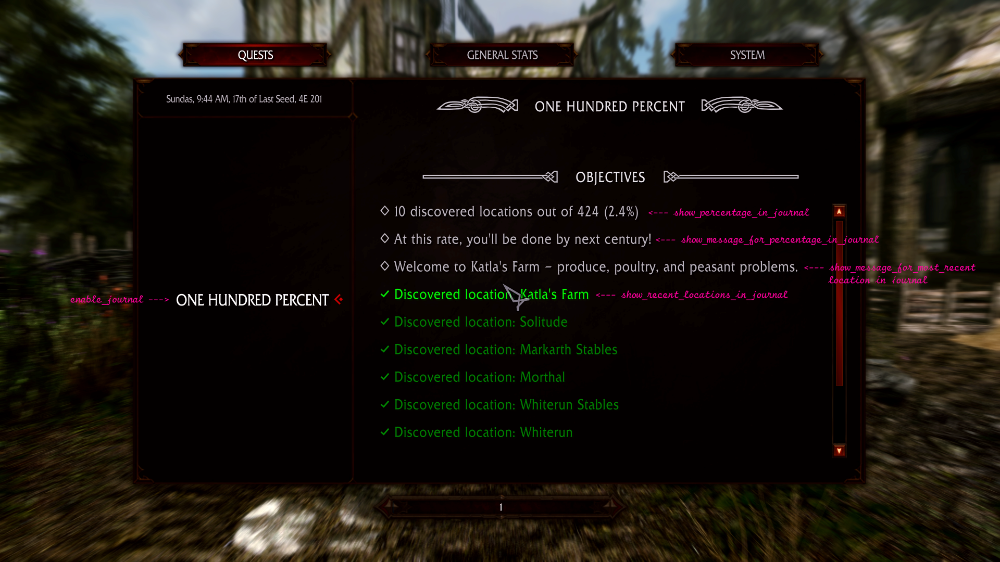

# Haz the Completionizt

**[Download from Releases](https://github.com/MrowrMisc/HazTheCompletionizt/releases)**





### `HazTheCompletionist.toml`

```toml
[OnScreenMessages]
enable_on_screen_messages = true
message_on_location_discovered = true
color_on_location_discovered = "00ffff"
message_on_location_cleared = true
color_on_location_cleared = "#ff0000"

[Journal]
enable_journal = true
show_percentage_in_journal = true
show_message_for_percentage_in_journal = true
show_recent_locations_in_journal = true
show_message_for_most_recent_location_in_journal = true
max_recent_locations_in_journal = 50
```

# Credits

- `digitalApple` - https://next.nexusmods.com/profile/digitalApple?gameId=1704
  > _for [`BountyQuestsRedoneNG`](https://github.com/digital-apple/BountyQuestsRedoneNG) for hooks for updating Quest objectives_ - `MIT License`
- `z4x` - https://next.nexusmods.com/profile/z4x?gameId=1704
  > _for [`Experience`](https://github.com/zax-ftw/Experience) for hooks for getting most recently cleared location info_ - `Apache-2.0 License`